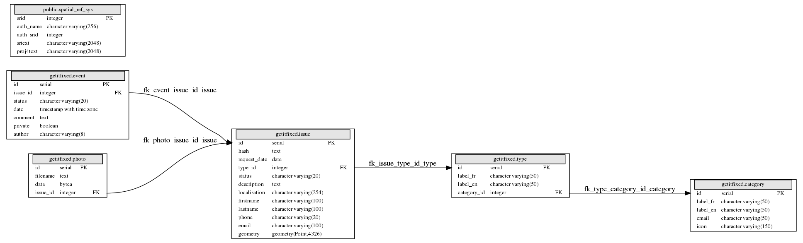

Database
=======================

MCD
-------------

Here is a view of the database

Issues
------
An Issue is the center part of the application. It is defined by

* a request date (when the issue is created)

* status (see bellow)

* description (a short text)

* localisation (complementary information on the location)

* geometry (actual coordinates of the issue)

* personal information (phone, email, ect..)

Events
------

Events are used to follow the progress of an issue.
When the reporter adds a comment to the issue, a new event is created, and an email is sent to the administrator.

Administrators can add a private or a public comment, and can also change the status of an issue.
Only a change of status will notify the reporter unless, the comment is private.

Status
------
Status are tags given in order to follow the progress of an issue:

* **New**: The issue has been successfully submitted (reporter)

* **Validated**: The issue has been accepted by the administrator of the category (admin)

* **in progress**: The issue is in the process of resolution (admin)

* **waiting for reporter**: the issue requires more information from the reporter (admin)

* **resolved** : the issue has been resolved and will no longer be shown in the public or private view (admin)

Categories
----------
A **Category** is the parent group. It is defined by a unique identifier.
Both labels in english and french are defined here. As well as a email address, that will be used when a new issue is created in this category.
You can also provide a custom icon to be used on the main map.

Types
-----
**Types** are the **child** elements of a Category. You are able to specify english
and french labels.
An Issue is directly linked to a Type.
